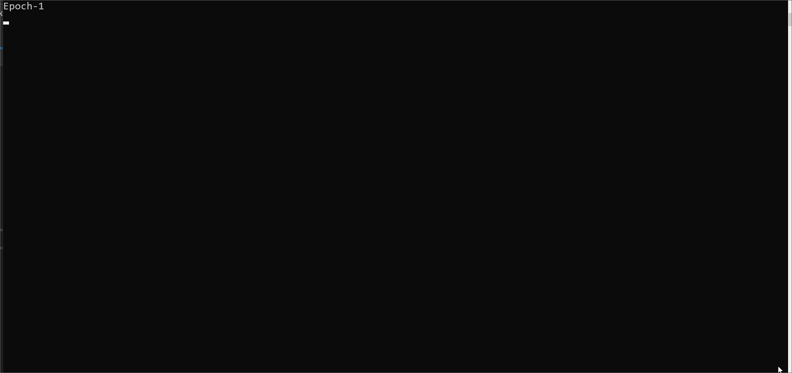

# AutoDiff
This project implements an API to create computational graphs and neural networks using C++ from scratch. 
Project was created with educational purposes in mind and does not offer the most efficient way of implementing neural networks.

## Build
1. `git clone https://github.com/tkchmax/AutoDiff.git`
2. `mkdir build`
3. `cd build`
4. `cmake ..`
5. Run it: `./AutoDiff`

## Example
**MNIST number classifier**

Preparing dataset:
```cpp
#include "MNIST.h"
auto labeled_2d = MNIST::Get().GetLabeledImages();
auto train_test = MNIST::Get().GetTrainTestSamples();

MNIST::LabeledSamples trainImg = train_test.first;
MNIST::LabeledSamples testImg = train_test.second;

std::vector<Tensor> train, labels;
for (int i = 0; i < trainImg.size(); ++i) {
    train.push_back(Tensor(Flatten(trainImg[i].second)).T());
    labels.push_back(Tensor(trainImg[i].first).T());
}
```
Creating model:
```cpp
Sequential model(
    Input(Tensor::Shape(28 * 28, 1)),
    DenseLayer(10, EActivation::softmax)
);
model.compile(ELoss::CROSS_ENTROPY, EMetrics::ACCURACY);
```
Training:
```cpp
int nEpoch = 2;
model.fit(train, labels, nEpoch);
```

Model validation on the test dataset:
```cpp
std::vector<Tensor> test, labels;
for (int i = 0; i < testImg.size(); ++i) {
    test.push_back(Tensor(Flatten(testImg[i].second)).T());
    labels.push_back(Tensor(testImg[i].first).T());
}

int r = rand() % test.size();
AccuracyMetric acc;
for (int i = 0; i < test.size(); ++i) {
    Tensor output = model.predict(test[i]);
    acc.update_state(output, labels[i]);

    if (i == r) {
        ShowImg(testImg[i].second);
        std::cout << "#" << r << " predicted: " << output.T();
    }
}
std::cout << "\nTest size: " << test.size() << std::endl;
std::cout << "Test Accuracy: " << acc.result() << std::endl;
}
```

### Expected Output

